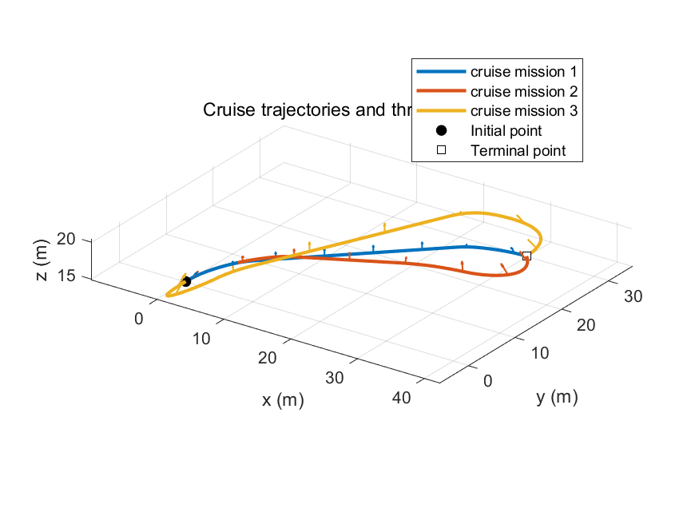
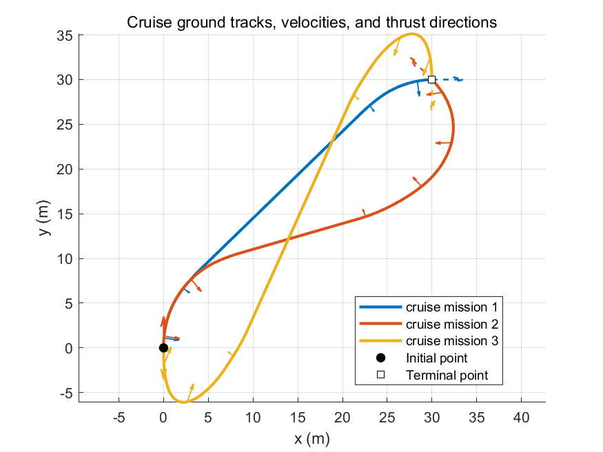
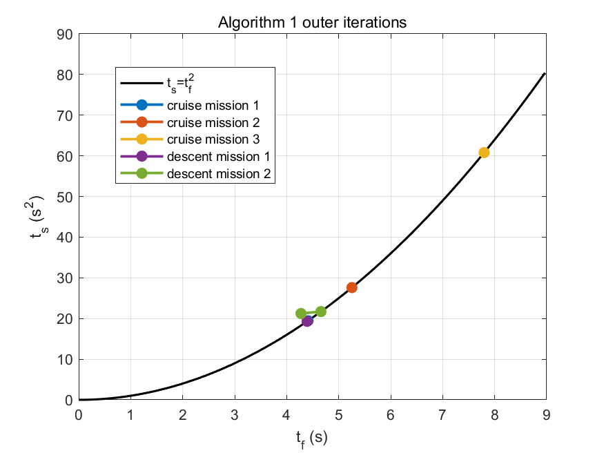
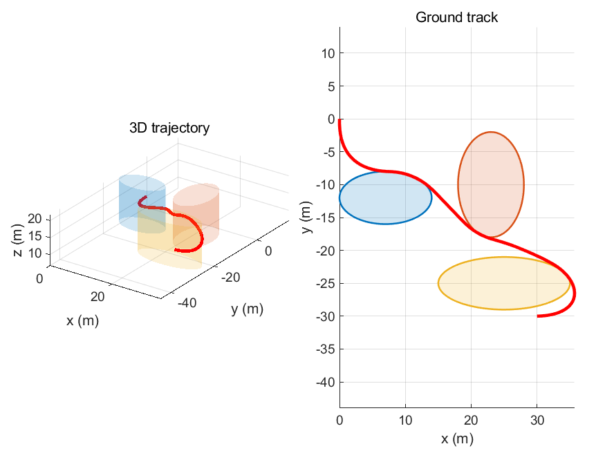
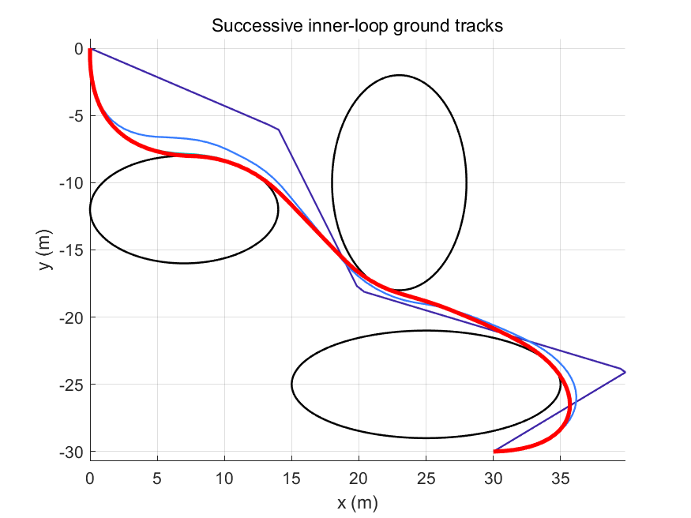
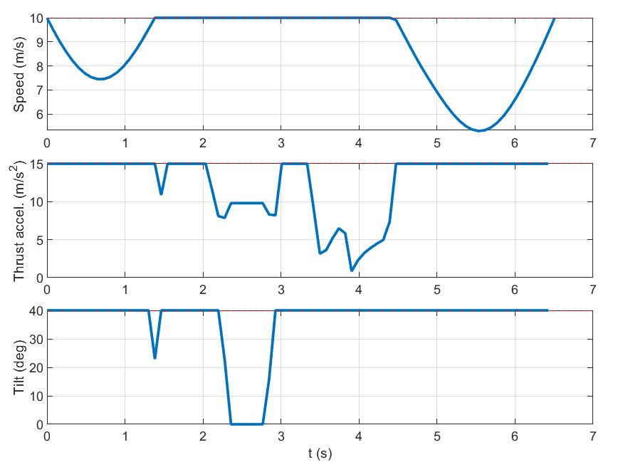
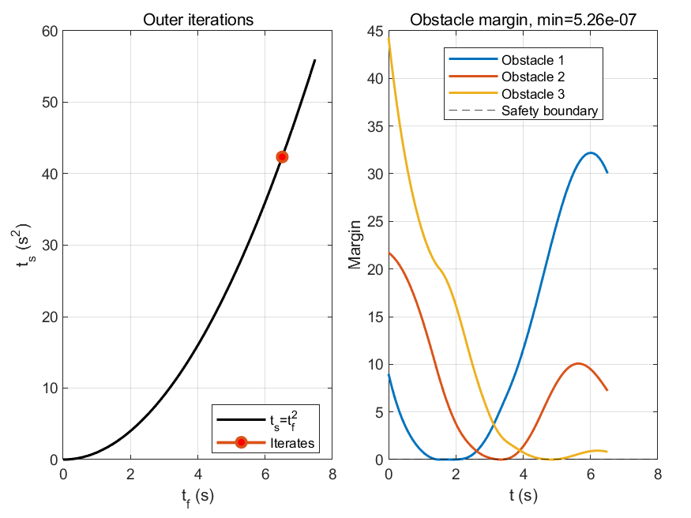

# 仿真复现报告

## 1. 仿真目的

本报告基于当前 MATLAB + CVX 复现项目，整理论文第 VI 节主要数值仿真和新增自定义测试场景的结果。报告只汇总仿真设置、参数、数值结果、合并图展示和复现结论，不展开算法推导，也不包含 NLP、IPOPT、GPOPS-II 或 CSCP 对比。

为避免版面重复，本版报告不再插入每个 case 的单独轨迹图、单独约束图和单独 tf-ts 图。对于具有相同初末位置的一组任务，仅插入合并轨迹图；对于 Algorithm 1 的外层迭代，仅插入统一的 tf-ts 合并图。单独 case 图仍可由脚本生成并保存在 `figures/`，但不作为报告正文图片。

## 2. 通用仿真参数

Algorithm 1 默认使用 MOSEK；Algorithm 2 的论文避障主脚本为提高可运行性显式使用 SDPT3，自定义避障脚本当前使用 MOSEK。表中的“求解器时间”来自求解器日志：MOSEK 读取 `Optimizer terminated. Time`，SDPT3 读取 `Total CPU time (secs)`，不包含 CVX 建模、转译和绘图时间。

| 参数 | 数值 | 说明 |
| --- | ---: | --- |
| N | 81 | 离散节点数 |
| vmax | 10 m/s | 最大速度 |
| amax | 15 m/s² | 最大推力加速度 |
| phi_max | 40 deg | 最大推力倾角 |
| g | [0, 0, -9.807] m/s² | 重力加速度 |
| eps_t | 0.001 | 外层收敛阈值 |
| eps_r | 0.1 | 障碍物内层收敛阈值 |
| solver | Algorithm 1: MOSEK；论文 Algorithm 2: SDPT3；自定义 Algorithm 2: MOSEK | CVX 求解器 |

## 3. 论文无避障巡航飞行

本节对应论文 Section VI.A 的 cruising flight。三个任务具有相同初末位置，不同初末速度。

### 3.1 初末状态

| Mission | r0 (m) | rf (m) | v0 (m/s) | vf (m/s) |
| --- | --- | --- | --- | --- |
| Mission 1 | [0, 0, 15] | [30, 30, 15] | [0, 10, 0] | [10, 0, 0] |
| Mission 2 | [0, 0, 15] | [30, 30, 15] | [-10, 0, 0] | [-5√2, 5√2, 0] |
| Mission 3 | [0, 0, 15] | [30, 30, 15] | [0, -10, 0] | [0, -10, 0] |

注：论文正文中 mission 2 的初始速度写为 `[0, 10, 0]`，但按该值复现得到的飞行时间约为 `5.254 s`，与论文报告的 `6.96 s` 不一致。经独立诊断，将 mission 2 初始速度设为 `[-10, 0, 0]` 时，飞行时间为 `6.956 s`，与论文结果吻合。因此本报告采用该设置作为与论文数值结果对齐的复现口径。

### 3.2 数值结果

| Mission | tf (s) | ts (s²) | gap | 外层迭代 | 求解器时间 (s) | 最大速度违反 | 最大推力违反 | 最大倾角违反 (deg) | r 残差 | vbar 残差 |
| --- | ---: | ---: | ---: | ---: | ---: | ---: | ---: | ---: | ---: | ---: |
| Mission 1 | 4.410276 | 19.450538 | 1.087e-10 | 1 | 0.030 | 0.000e+00 | -2.761e-09 | -4.206e-09 | 7.225e-12 | 5.040e-15 |
| Mission 2 | 6.956200 | 48.388717 | 3.034e-08 | 1 | 0.030 | 0.000e+00 | -4.695e-09 | -1.513e-08 | 9.084e-11 | 1.425e-14 |
| Mission 3 | 7.797225 | 60.796720 | 2.490e-07 | 1 | 0.030 | 1.776e-15 | -7.233e-09 | -2.117e-08 | 1.419e-10 | 1.158e-14 |

### 3.3 与论文结果对比

| Mission | 本复现 tf (s) | 论文 tf (s) | 差值 (s) |
| --- | ---: | ---: | ---: |
| Mission 1 | 4.410276 | 4.41 | 0.000276 |
| Mission 2 | 6.956200 | 6.96 | -0.003800 |
| Mission 3 | 7.797225 | 7.80 | -0.002775 |

### 3.4 合并图

图 1a 将三个 cruising missions 的三维轨迹画在同一张图中。箭头表示轨迹若干节点处的推力加速度方向。

图 1b 给出三个 cruising missions 的 x-y 地面轨迹对比，并标注推力加速度方向以及初末速度方向。报告不再插入每个 mission 的单独轨迹图。

## 4. 论文无避障下降飞行

本节对应论文 Section VI.B 的 descending flight。两个下降任务初始状态相同、末端速度相同，但末端位置不同，因此本报告只给出表格结果，不再插入两个任务的单独轨迹图。

### 4.1 初末状态

| Mission | r0 (m) | rf (m) | v0 (m/s) | vf (m/s) |
| --- | --- | --- | --- | --- |
| Mission 1 | [0, 0, 30] | [20, -10, 6] | [8, 2, 1] | [5, 0, 0] |
| Mission 2 | [0, 0, 30] | [10, -10, 6] | [8, 2, 1] | [5, 0, 0] |

### 4.2 数值结果

| Mission | tf (s) | ts (s²) | gap | 外层迭代 | 求解器时间 (s) | 最大速度违反 | 最大推力违反 | 最大倾角违反 (deg) | r 残差 | vbar 残差 |
| --- | ---: | ---: | ---: | ---: | ---: | ---: | ---: | ---: | ---: | ---: |
| Mission 1 | 4.393234 | 19.300504 | 4.409e-10 | 1 | 0.030 | -1.775e-10 | -2.268e-10 | -2.869e-09 | 5.524e-12 | 1.022e-14 |
| Mission 2 | 4.658758 | 21.704027 | 6.838e-10 | 2 | 0.100 | -8.185e-08 | -4.534e-08 | -4.569e-07 | 1.424e-11 | 1.290e-14 |

### 4.3 与论文结果对比

| Mission | 本复现 tf (s) | 论文 tf (s) | 差值 (s) |
| --- | ---: | ---: | ---: |
| Mission 1 | 4.393234 | 4.39 | 0.003234 |
| Mission 2 | 4.658758 | 4.66 | -0.001242 |

### 4.4 Algorithm 1 迭代合并图

图 2 将 Algorithm 1 五个论文无避障任务的 tf-ts 外层迭代点画在同一张图中，用于比较各任务的收敛位置及其与 `ts=tf^2` 曲线的关系。

## 5. 论文三障碍物避障飞行

本节对应论文 Section VI.C 的第一组三障碍物避障场景。

### 5.1 初末状态和障碍物

| 参数 | 数值 |
| --- | --- |
| r0 | [0, 0, 10] m |
| v0 | [0, -10, 0] m/s |
| rf | [30, -30, 14] m |
| vf | [-10, 0, 0] m/s |
| 初始折线点 | [0,0,10]、[14,-6,11]、[20,-18,12]、[40,-24,13]、[30,-30,14] |

| 障碍物 | xc | yc | ac | bc | 类型 |
| --- | ---: | ---: | ---: | ---: | --- |
| 1 | 7 | -12 | 7 | 4 | 椭圆柱 |
| 2 | 23 | -10 | 5 | 8 | 椭圆柱 |
| 3 | 25 | -25 | 10 | 4 | 椭圆柱 |

### 5.2 数值结果

| 指标 | 数值 |
| --- | ---: |
| tf (s) | 6.507406 |
| ts (s²) | 42.346334 |
| gap | 1.807e-10 |
| 外层迭代次数 | 1 |
| 内层迭代次数 | 4 |
| 累计求解器时间 (s) | 9.880 |
| 内层单次求解器时间 (s) | [2.760, 2.370, 2.400, 2.350] |
| 全局最小 obstacle margin | 5.265e-07 |
| obstacle 1 最小 margin | 5.265e-07 |
| obstacle 2 最小 margin | 9.309e-07 |
| obstacle 3 最小 margin | 8.671e-07 |
| 最大速度违反 | 0.000e+00 |
| 最大推力违反 | -1.998e-11 |
| 最大倾角违反 (deg) | -6.675e-11 |
| r 动力学残差 | 4.271e-13 |
| vbar 动力学残差 | 9.967e-15 |

### 5.3 与论文结果对比

| 指标 | 本复现 | 论文 |
| --- | ---: | ---: |
| tf | 6.507406 s | 6.51 s |
| 外层迭代次数 | 1 | 1 |
| 内层迭代次数 | 4 | 4 |
| 累计求解器时间 | 9.880 s | 约 83 ms |
| 是否避障安全 | min margin = 5.265e-07 >= 0 | 成功避障 |

论文同时报告 NLP solver 的飞行时间约为 `6.49 s`，以及 Algorithm 2 的总计算时间约为 `83 ms`。本项目使用 MATLAB CVX 复现，上表中的 `9.880 s` 仅累计 SDPT3 求解器日志时间，不包含 CVX 转译时间；由于实现语言、建模接口、求解器和硬件环境不同，该时间只作为当前复现实验记录。

### 5.4 场景图

Algorithm 2 只有一个论文避障场景，因此报告保留场景级图：三维/地面轨迹、内层逐次轨迹、约束曲线和安全裕度收敛图。

## 6. 新增自定义测试场景

本节记录项目新增的非论文测试场景。它们用于验证同一 CVX/SOCP 实现对其他初末状态和障碍物配置的适用性，不参与论文结果误差对比。

### 6.1 Algorithm 1 自定义无障碍任务

脚本为 `main_alg1_no_obstacle_personal.m`。三个任务均使用默认 `N=81`、`vmax=10`、`amax=15`、`phi_max=40 deg` 和 MOSEK。

| Case | r0 | rf | v0 | vf | tf (s) | ts (s²) | gap | 外层迭代 | 求解器时间 (s) | r 残差 | vbar 残差 |
| --- | --- | --- | --- | --- | ---: | ---: | ---: | ---: | ---: | ---: | ---: |
| Custom 1 | [0, 0, 40] | [10, 0, 0] | [0, 0, 0] | [0, 0, 0] | 5.572260 | 31.050080 | 2.962e-09 | 1 | 0.030 | 8.356e-11 | 1.634e-14 |
| Custom 2 | [0, 0, 40] | [10, 0, 0] | [0, 0, 0] | [5, 5, 0] | 5.569694 | 31.021497 | 4.310e-07 | 1 | 0.030 | 1.050e-08 | 8.564e-15 |
| Custom 3 | [0, 0, 40] | [10, 0, 5] | [0, 0, 0] | [0, -10, 0] | 5.480830 | 30.039496 | 1.864e-06 | 1 | 0.020 | 2.058e-08 | 8.927e-15 |

三个自定义任务的速度、推力加速度和倾角最大违反量在脚本输出中均为 `0.000e+00` 量级，说明求解结果满足约束。

### 6.2 Algorithm 2 自定义避障任务

脚本为 `main_alg2_obstacle_personal.m`，障碍物由 `make_obstacles_case2.m` 定义。该脚本当前使用 MOSEK。

| 参数 | 数值 |
| --- | --- |
| r0 | [0, 0, 0] |
| rf | [40, 40, 40] |
| v0 | [-1, 1, 2] |
| vf | [5, 5, 5] |
| 初始折线点 | [0,0,0]、[-6,18,10]、[5,35,20]、[20,45,30]、[40,40,40] |

| 障碍物 | xc | yc | ac | bc |
| --- | ---: | ---: | ---: | ---: |
| 1 | 10 | 10 | 10 | 10 |
| 2 | 25 | 25 | 10 | 10 |

| 指标 | 数值 |
| --- | ---: |
| tf (s) | 7.872593 |
| ts (s²) | 61.977724 |
| gap | 2.110e-07 |
| 外层迭代次数 | 1 |
| 内层迭代次数 | 4 |
| 累计求解器时间 (s) | 0.130 |
| 内层单次求解器时间 (s) | [0.030, 0.050, 0.030, 0.020] |
| 全局最小 obstacle margin | 1.580e-07 |
| obstacle 1 最小 margin | 1.580e-07 |
| obstacle 2 最小 margin | 2.336e-07 |
| 最大速度违反 | 0.000e+00 |
| 最大推力违反 | 0.000e+00 |
| 最大倾角违反 (deg) | 0.000e+00 |
| r 动力学残差 | 1.793e-09 |
| vbar 动力学残差 | 1.521e-14 |

该自定义避障场景的最小 obstacle margin 为正，说明最终离散轨迹满足两个椭圆柱障碍物的安全裕度要求。

## 7. 结果总结

Algorithm 1 的三个论文巡航任务和两个论文下降任务与论文报告结果吻合；其中 cruising mission 2 采用与论文飞行时间相吻合的初始速度 `v0=[-10;0;0]` 后，得到 `tf≈6.956 s`。Algorithm 2 的论文三障碍物避障任务得到 `tf≈6.507 s`、外层 1 次、内层 4 次、最小避障裕度为正。

新增自定义场景不属于论文复现实验，但 Algorithm 1 和 Algorithm 2 均能在这些新初末状态与障碍物设置下得到满足约束的可行轨迹。所有报告中的求解器时间均只统计 MOSEK 或 SDPT3 日志中的实际优化求解时间，不统计 CVX 转译时间。

## 8. 附录：报告引用文件

本报告主要读取或引用以下文件：

- `main_alg1_no_obstacle.m`
- `main_alg2_obstacle.m`
- `main_alg1_no_obstacle_personal.m`
- `main_alg2_obstacle_personal.m`
- `make_default_params.m`
- `make_obstacles_case1.m`
- `make_obstacles_case2.m`
- `solve_alg1_cvx.m`
- `solve_alg2_cvx.m`
- `results/cruise_mission_1.mat`
- `results/cruise_mission_2.mat`
- `results/cruise_mission_3.mat`
- `results/descent_mission_1.mat`
- `results/descent_mission_2.mat`
- `results/obstacle_case1.mat`
- `figures/alg1_cruise_combined_3d.png`
- `figures/alg1_cruise_combined_ground.png`
- `figures/alg1_combined_tf_ts.png`
- `figures/obstacle_case1_trajectory.png`
- `figures/obstacle_case1_successive_tracks.png`
- `figures/obstacle_case1_constraints.png`
- `figures/obstacle_case1_convergence_margin.png`

缺失文件列表：无。
