# 仿真复现报告

## 1. 仿真目的

本报告基于当前 MATLAB + CVX 复现项目，整理论文第 VI 节数值仿真的复现结果。报告主要包括 Algorithm 1 的无避障巡航飞行、Algorithm 1 的无避障下降飞行，以及 Algorithm 2 的三障碍物避障飞行。本文档只汇总仿真设置、仿真参数、数值结果、图表展示和与论文结果的对比，不包含 NLP、IPOPT、GPOPS-II 或 CSCP 对比。

## 2. 通用仿真参数

通用参数从 `make_default_params.m` 及现有 `.mat` 结果读取。Algorithm 1 已有结果使用默认 MOSEK 求解器；Algorithm 2 主脚本为保证避障案例稳定运行，显式使用 SDPT3。

| 参数 | 数值 | 说明 |
| --- | ---: | --- |
| N | 81 | 离散节点数 |
| vmax | 10 m/s | 最大速度 |
| amax | 15 m/s² | 最大推力加速度 |
| phi_max | 40 deg | 最大推力倾角 |
| g | [0, 0, -9.807] m/s² | 重力加速度 |
| eps_t | 0.001 | 外层收敛阈值 |
| eps_r | 0.1 | 障碍物内层收敛阈值 |
| solver | Algorithm 1: MOSEK；Algorithm 2: SDPT3 | CVX 求解器 |

## 3. 无避障巡航飞行仿真

本节对应论文 Section VI.A 的 cruising flight。

### 3.1 初末状态设置

| Mission | r0 (m) | rf (m) | v0 (m/s) | vf (m/s) |
| --- | --- | --- | --- | --- |
| Mission 1 | [0, 0, 15] | [30, 30, 15] | [0, 10, 0] | [10, 0, 0] |
| Mission 2 | [0, 0, 15] | [30, 30, 15] | [0, 10, 0] | [-5√2, 5√2, 0] |
| Mission 3 | [0, 0, 15] | [30, 30, 15] | [0, -10, 0] | [0, -10, 0] |

### 3.2 数值结果

| Mission | tf (s) | ts (s²) | gap | 外层迭代次数 | 最大速度违反 | 最大推力违反 | 最大倾角违反 (deg) | r 动力学残差 | vbar 动力学残差 |
| --- | ---: | ---: | ---: | ---: | ---: | ---: | ---: | ---: | ---: |
| Mission 1 | 4.410276 | 19.450538 | 1.087e-10 | 1 | 0.000e+00 | -2.761e-09 | -4.206e-09 | 7.225e-12 | 5.040e-15 |
| Mission 2 | 5.254059 | 27.605138 | 3.112e-09 | 1 | 0.000e+00 | -4.719e-09 | -9.939e-09 | 5.922e-11 | 1.146e-14 |
| Mission 3 | 7.797225 | 60.796720 | 2.490e-07 | 1 | 1.776e-15 | -7.233e-09 | -2.117e-08 | 1.419e-10 | 1.158e-14 |

### 3.3 与论文结果对比

| Mission | 本复现 tf (s) | 论文 tf (s) | 差值 (s) |
| --- | ---: | ---: | ---: |
| Mission 1 | 4.410276 | 4.41 | 0.000276 |
| Mission 2 | 5.254059 | 6.96 | -1.705941 |
| Mission 3 | 7.797225 | 7.80 | -0.002775 |

Mission 2 按论文正文给出的 `vf=[-5*sqrt(2); 5*sqrt(2); 0]` 复现时，本项目得到约 `5.254 s`，与论文报告的 `6.96 s` 不一致。已有独立诊断显示该解满足动力学与路径约束，差异可能来自论文任务描述、报告时间或未写明设置的不一致。

### 3.4 仿真图

图 1a 将三个 cruising missions 画在同一张图中。三条轨迹具有相同的初末位置，但初末速度方向不同；图中箭头表示沿轨迹若干节点处的推力加速度方向，地面轨迹中的实线箭头和虚线箭头分别标记初始速度与末端速度方向。

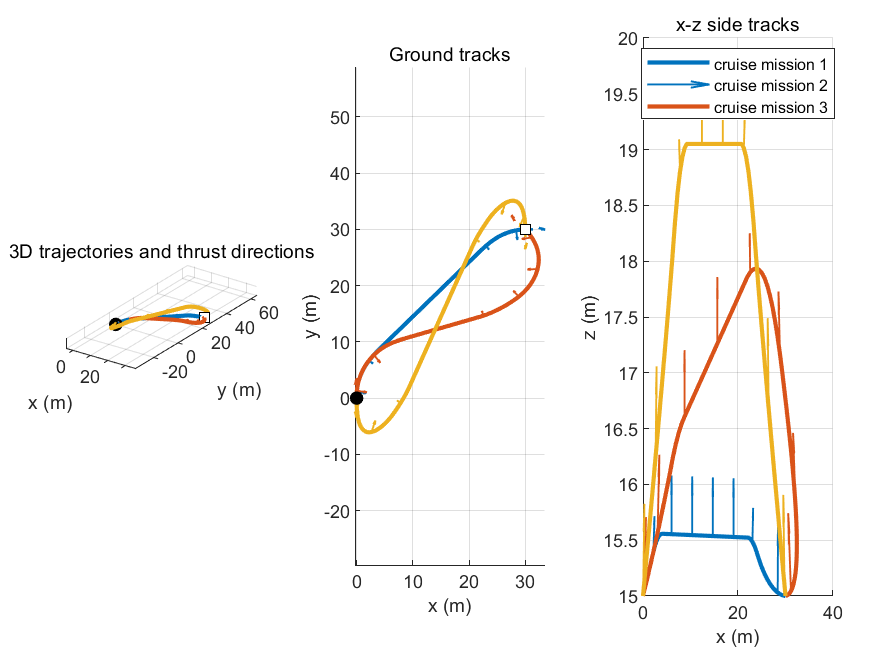

图 1 给出了 cruise mission 1 的三维轨迹、地面轨迹和侧视轨迹。

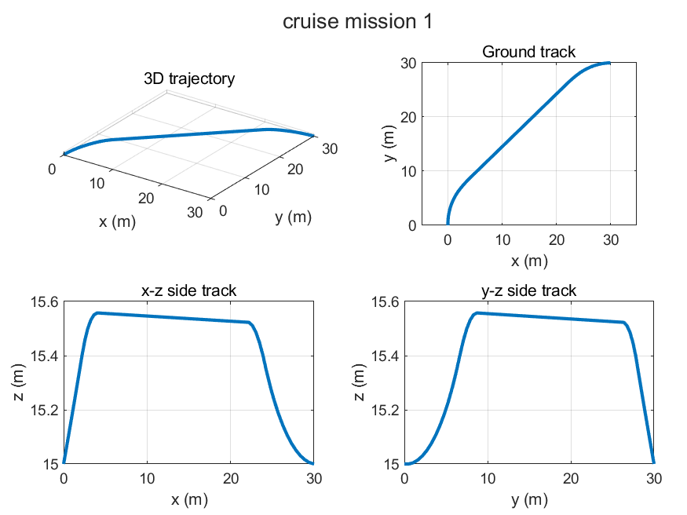

图 2 给出了 cruise mission 1 的速度、推力加速度和推力倾角约束曲线。

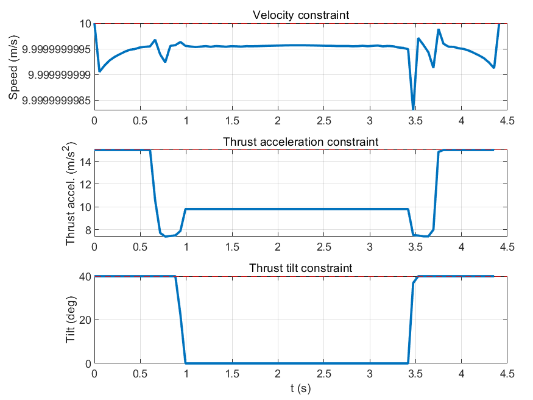

图 3 给出了 cruise mission 1 的 tf-ts 外层迭代点。

图 4 给出了 cruise mission 2 的三维轨迹、地面轨迹和侧视轨迹。

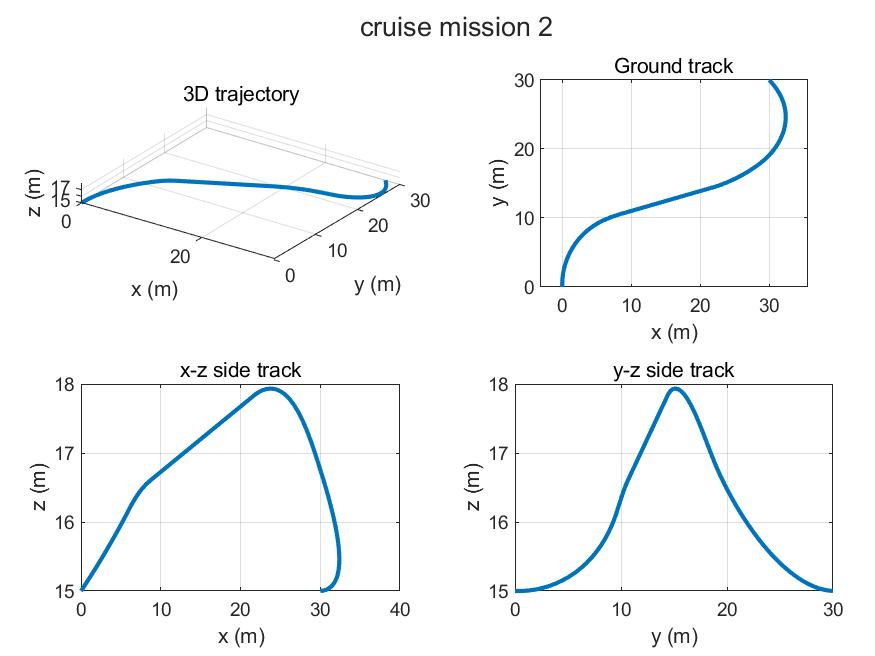

图 5 给出了 cruise mission 2 的速度、推力加速度和推力倾角约束曲线。

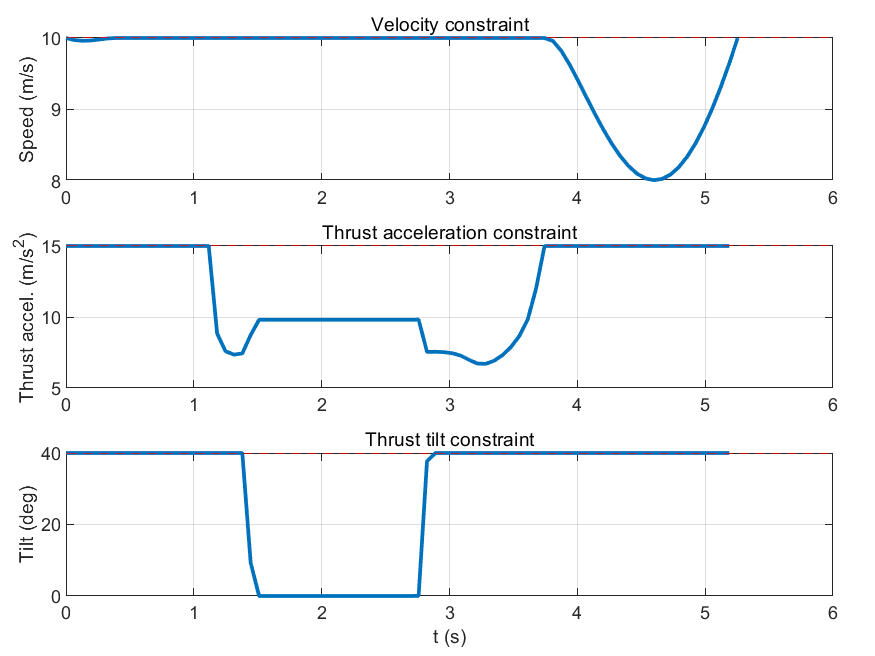

图 6 给出了 cruise mission 2 的 tf-ts 外层迭代点。

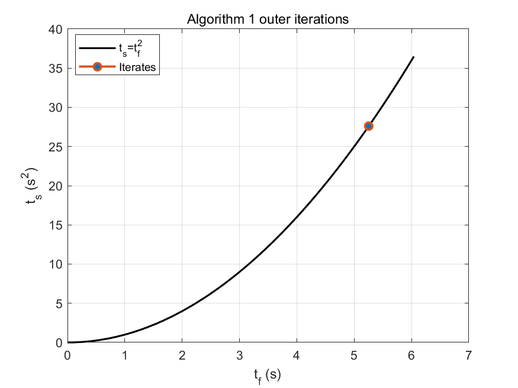

图 7 给出了 cruise mission 3 的三维轨迹、地面轨迹和侧视轨迹。

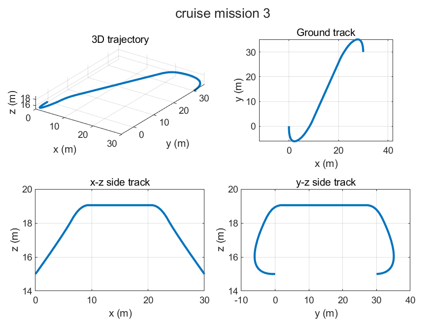

图 8 给出了 cruise mission 3 的速度、推力加速度和推力倾角约束曲线。

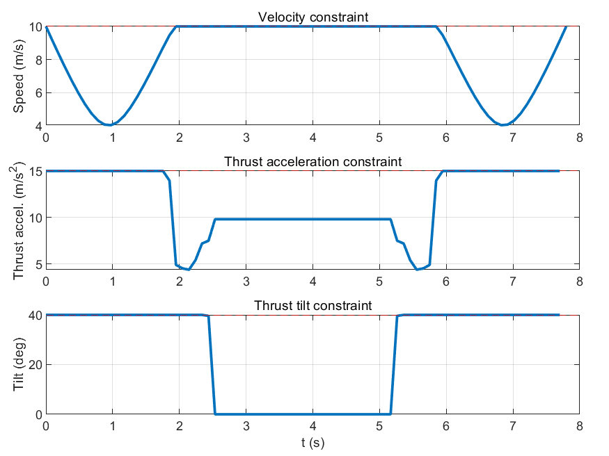

图 9 给出了 cruise mission 3 的 tf-ts 外层迭代点。

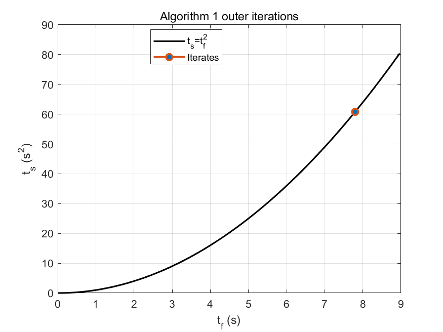

## 4. 无避障下降飞行仿真

本节对应论文 Section VI.B 的 descending flight。

### 4.1 初末状态设置

| Mission | r0 (m) | rf (m) | v0 (m/s) | vf (m/s) |
| --- | --- | --- | --- | --- |
| Mission 1 | [0, 0, 30] | [20, -10, 6] | [8, 2, 1] | [5, 0, 0] |
| Mission 2 | [0, 0, 30] | [10, -10, 6] | [8, 2, 1] | [5, 0, 0] |

### 4.2 数值结果

| Mission | tf (s) | ts (s²) | gap | 外层迭代次数 | 最大速度违反 | 最大推力违反 | 最大倾角违反 (deg) | r 动力学残差 | vbar 动力学残差 |
| --- | ---: | ---: | ---: | ---: | ---: | ---: | ---: | ---: | ---: |
| Mission 1 | 4.393234 | 19.300504 | 4.409e-10 | 1 | -1.775e-10 | -2.268e-10 | -2.869e-09 | 5.524e-12 | 1.022e-14 |
| Mission 2 | 4.658758 | 21.704027 | 6.838e-10 | 2 | -8.185e-08 | -4.534e-08 | -4.569e-07 | 1.424e-11 | 1.290e-14 |

### 4.3 与论文结果对比

| Mission | 本复现 tf (s) | 论文 tf (s) | 差值 (s) |
| --- | ---: | ---: | ---: |
| Mission 1 | 4.393234 | 4.39 | 0.003234 |
| Mission 2 | 4.658758 | 4.66 | -0.001242 |

### 4.4 仿真图

图 9a 将 Algorithm 1 五个无避障任务的 tf-ts 外层迭代点画在同一张图中，用于比较各任务的收敛位置及其与 `ts=tf^2` 曲线的关系。

图 10 给出了 descent mission 1 的三维轨迹、地面轨迹和侧视轨迹。

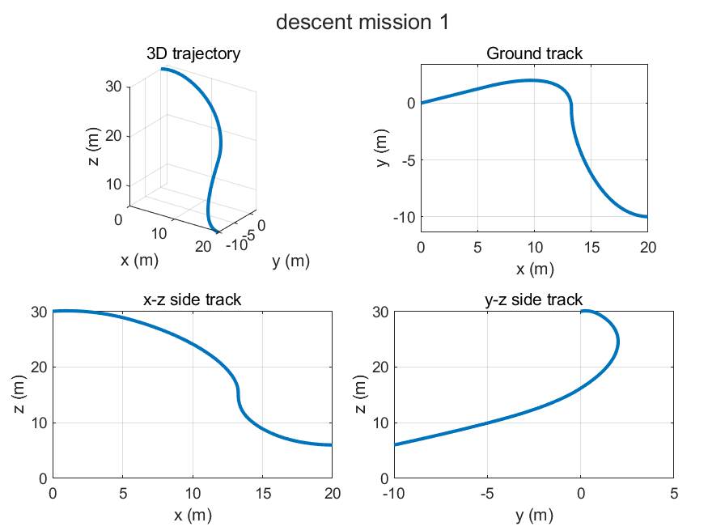

图 11 给出了 descent mission 1 的速度、推力加速度和推力倾角约束曲线。

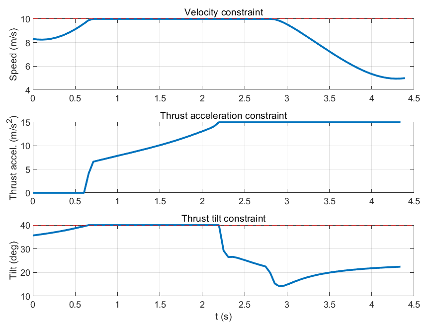

图 12 给出了 descent mission 1 的 tf-ts 外层迭代点。

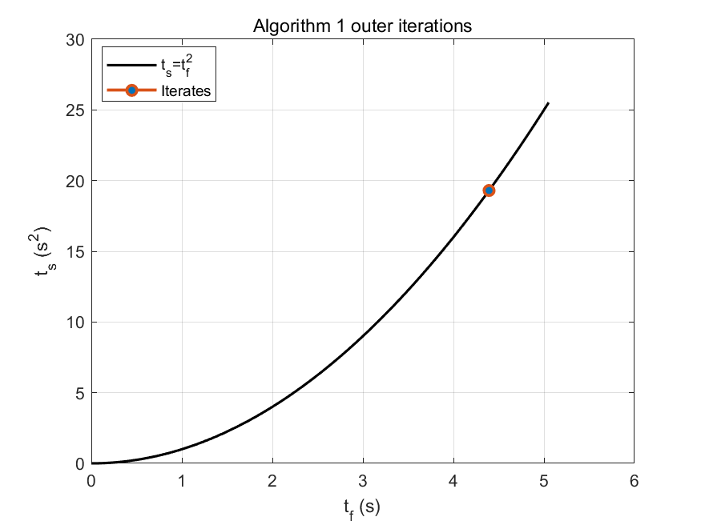

图 13 给出了 descent mission 2 的三维轨迹、地面轨迹和侧视轨迹。

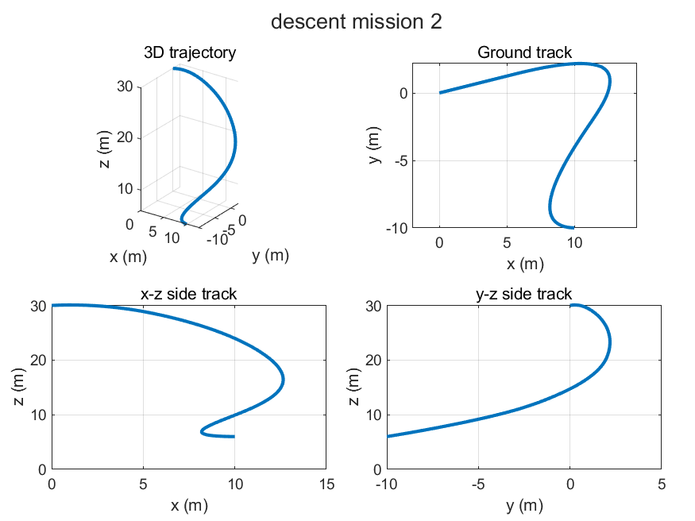

图 14 给出了 descent mission 2 的速度、推力加速度和推力倾角约束曲线。

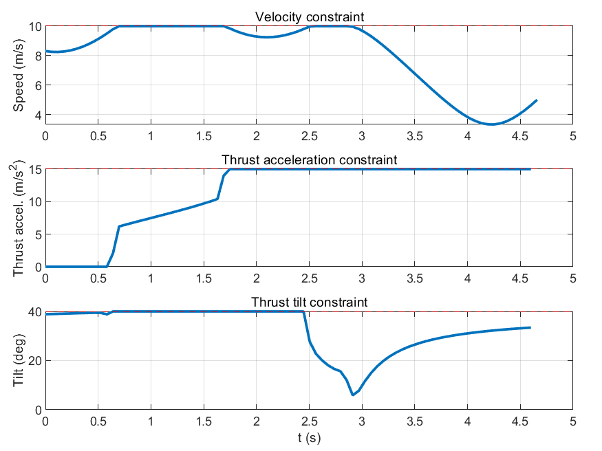

图 15 给出了 descent mission 2 的 tf-ts 外层迭代点。

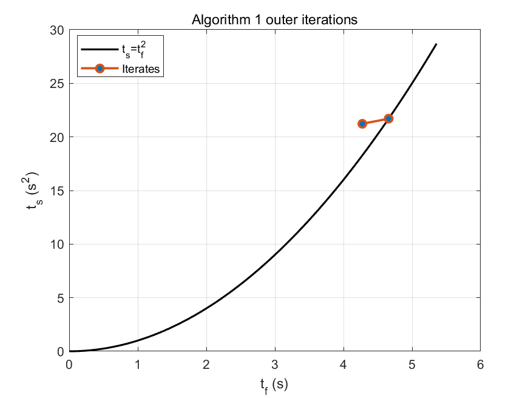

## 5. 三障碍物避障飞行仿真

本节对应论文 Section VI.C 的第一组三障碍物避障场景。

### 5.1 初末状态设置

| 参数 | 数值 |
| --- | --- |
| r0 | [0, 0, 10] m |
| v0 | [0, -10, 0] m/s |
| rf | [30, -30, 14] m |
| vf | [-10, 0, 0] m/s |

### 5.2 障碍物参数

| 障碍物 | xc | yc | ac | bc | 类型 |
| --- | ---: | ---: | ---: | ---: | --- |
| 1 | 7 | -12 | 7 | 4 | 椭圆柱 |
| 2 | 23 | -10 | 5 | 8 | 椭圆柱 |
| 3 | 25 | -25 | 10 | 4 | 椭圆柱 |

### 5.3 初始轨迹折线点

| 点 | x | y | z |
| --- | ---: | ---: | ---: |
| p0 | 0 | 0 | 10 |
| p1 | 14 | -6 | 11 |
| p2 | 20 | -18 | 12 |
| p3 | 40 | -24 | 13 |
| p4 | 30 | -30 | 14 |

### 5.4 数值结果

| 指标 | 数值 |
| --- | ---: |
| tf (s) | 6.507406 |
| ts (s²) | 42.346334 |
| gap | 1.807e-10 |
| 外层迭代次数 | 1 |
| 内层迭代次数 | 4 |
| 全局最小 obstacle margin | 5.265e-07 |
| obstacle 1 最小 margin | 5.265e-07 |
| obstacle 2 最小 margin | 9.309e-07 |
| obstacle 3 最小 margin | 8.671e-07 |
| 最大速度违反 | 0.000e+00 |
| 最大推力违反 | -1.998e-11 |
| 最大倾角违反 (deg) | -6.675e-11 |
| r 动力学残差 | 4.271e-13 |
| vbar 动力学残差 | 9.967e-15 |

### 5.5 与论文结果对比

| 指标 | 本复现 | 论文 |
| --- | ---: | ---: |
| tf | 6.507406 s | 6.51 s |
| 外层迭代次数 | 1 | 1 |
| 内层迭代次数 | 4 | 4 |
| 是否避障安全 | min margin = 5.265e-07 >= 0 | 成功避障 |

论文同时报告 NLP solver 的飞行时间约为 `6.49 s`，以及 Algorithm 2 的总计算时间约为 `83 ms`。本项目使用 MATLAB CVX 复现，运行时间受 MATLAB、CVX、求解器和本机环境影响较大，因此本报告不以毫秒级计算时间作为主要对比指标。

### 5.6 仿真图

图 16 给出了三障碍物场景的三维轨迹和地面轨迹。

图 17 给出了三障碍物场景中内层循环的逐次地面轨迹。

图 18 给出了三障碍物场景的速度、推力加速度和推力倾角约束曲线。

图 19 给出了三障碍物场景的 tf-ts 外层迭代点和障碍物安全裕度。

## 6. 仿真结果总结

Algorithm 1 的 cruising mission 1、cruising mission 3 以及两个 descending missions 与论文报告结果吻合。Cruising mission 2 按论文正文参数复现时出现明显差异，本项目得到的 `tf` 约为 `5.254 s`，短于论文报告的 `6.96 s`；独立诊断表明该轨迹满足动力学和路径约束，因此该差异更可能来自论文任务描述、报告时间或未写明设置的不一致。

Algorithm 2 的三障碍物避障任务与论文 Section VI.C 第一场景结果吻合，飞行时间约为 `6.507 s`，外层迭代 1 次，内层迭代 4 次，最小避障裕度为正。所有报告轨迹均满足速度、推力加速度、推力倾角约束；避障任务同时满足障碍物安全裕度要求。由于本项目采用 MATLAB CVX 环境，计算时间不作为与论文毫秒级结果直接对比的重点。

## 7. 附录：生成报告所用文件

本报告主要读取或引用以下文件：

- `main_alg1_no_obstacle.m`
- `main_alg2_obstacle.m`
- `make_default_params.m`
- `make_obstacles_case1.m`
- `results/cruise_mission_1.mat`
- `results/cruise_mission_2.mat`
- `results/cruise_mission_3.mat`
- `results/descent_mission_1.mat`
- `results/descent_mission_2.mat`
- `results/obstacle_case1.mat`
- `figures/alg1_cruise_combined_tracks.png`
- `figures/alg1_combined_tf_ts.png`
- `figures/cruise_mission_1_tracks.png`
- `figures/cruise_mission_1_constraints.png`
- `figures/cruise_mission_1_tf_ts.png`
- `figures/cruise_mission_2_tracks.png`
- `figures/cruise_mission_2_constraints.png`
- `figures/cruise_mission_2_tf_ts.png`
- `figures/cruise_mission_3_tracks.png`
- `figures/cruise_mission_3_constraints.png`
- `figures/cruise_mission_3_tf_ts.png`
- `figures/descent_mission_1_tracks.png`
- `figures/descent_mission_1_constraints.png`
- `figures/descent_mission_1_tf_ts.png`
- `figures/descent_mission_2_tracks.png`
- `figures/descent_mission_2_constraints.png`
- `figures/descent_mission_2_tf_ts.png`
- `figures/obstacle_case1_trajectory.png`
- `figures/obstacle_case1_successive_tracks.png`
- `figures/obstacle_case1_constraints.png`
- `figures/obstacle_case1_convergence_margin.png`

缺失文件列表：无。
